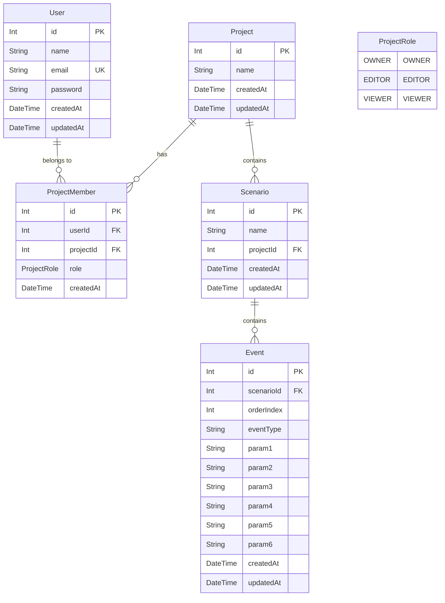

# システム仕様書 (System Specification)

本ドキュメントは、`novel-dashboard` プロジェクトの最新コードベースおよびDBスキーマの分析結果に基づき作成された仕様書です。

---

## 1. システム概要・技術スタック

### 【技術スタック】
* **Frontend**: Next.js (App Router), React, TanStack Query (`@tanstack/react-query`), Tailwind CSS, `@hello-pangea/dnd` (ドラッグ＆ドロップ)
* **Backend**: NestJS, TypeScript, Passport.js (`passport-jwt`), bcrypt, `class-validator` / `class-transformer`
* **ORM / Database**: Prisma ORM, PostgreSQL

---

## 2. データモデル仕様 (Prisma Schema)

### 【データモデル構造 (ER図)】

### 【エンティティ定義と制約】
1. **User**
   * メールアドレス (`email`) に UNIQUE 制約あり。
   * `password` は `bcrypt` によりハッシュ化された文字列を保持。
2. **Project**
   * ノベルゲーム作品の最上位コンテナ。
3. **ProjectMember**
   * `User` と `Project` の中間テーブル。
   * 複合ユニーク制約 `@@unique([userId, projectId])` を保持。
   * ロール (`ProjectRole` Enum): `OWNER`, `EDITOR`, `VIEWER`。
4. **Scenario**
   * `Project` に属する章・話・シーン単位。`projectId` を外部キーとして参照。カスケード削除 (`onDelete: Cascade`) 対応。
5. **Event**
   * `Scenario` に属する演出・テキストイベント。
   * `orderIndex`: シナリオ内での表示・実行順序（デフォルト値 `0`）。
   * 複合ユニーク制約 `@@unique([scenarioId, orderIndex])`: 同一シナリオ内での `orderIndex` 重複不可。
   * 汎用パラメータ列: `param1` 〜 `param6` (すべて Nullable)。演出タイプ (`eventType`) に応じた柔軟なアセット指定やセリフ・パラメータ格納に使用。

---

## 3. バックエンド アーキテクチャ & 認可制御 (RBAC)

### 【モジュール構成】
* **`AppModule`**: ルートモジュール。`ConfigModule.forRoot({ isGlobal: true })` および各機能モジュールを全読み込み。
* **`PrismaModule`**: グローバルモジュール。DB接続管理・クエリ実行を担う `PrismaService` を提供。
* **`UserModule`**: ユーザー登録・検索機能を提供。
* **`AuthModule`**: ログイン認証、パスワード照合、JWT 発行および保護を提供 (`JwtAuthGuard`, `JwtStrategy`, `@CurrentUser` デコレータ)。
* **`ProjectModule`**: プロジェクト一覧・作成・詳細・更新・削除およびメンバー招待機能を提供。
* **`ScenarioModule`**: シナリオのCRUD機能を提供。
* **`EventModule`**: イベントのCRUD機能およびドラッグ＆ドロップ等に対応する一括並べ替え (`reorder`) 機能を提供。

### 【認可制御 (Role-Based Access Control)】
`ProjectPermissionService` を通じて、プロジェクトメンバーのロールに応じたセキュリティ検証を統一適用しています。
* **`requireOwner(userId, projectId)`**: プロジェクト削除、メンバー追加・削除、イベント/シナリオ削除などのオーナー専用操作。
* **`requireEditor(userId, projectId)`**: プロジェクト名更新、シナリオ・イベントの作成および編集操作。
* **`requireViewer(userId, projectId)`**: プロジェクト・シナリオ・イベントの閲覧操作。

---

## 4. API エンドポイント一覧

すべての保護されたエンドポイントは `Authorization: Bearer <token>` ヘッダーによる認証を要求します。

| カテゴリ | 機能 | HTTP | エンドポイント | Auth Guard | 必要権限 | リクエスト Body / パラメータ |
|---|---|---|---|---|---|---|
| **認証** | ユーザー登録 | `POST` | `/users` | なし | 全員 | `{ name, email, password }` |
| | ログイン | `POST` | `/auth/login` | なし | 全員 | `{ email, password }` |
| **プロジェクト** | プロジェクト一覧 | `GET` | `/projects` | `JwtAuthGuard` | ログイン済 | なし (所属プロジェクトのみ返却) |
| | プロジェクト作成 | `POST` | `/projects` | `JwtAuthGuard` | ログイン済 | `{ name }` (作成者を OWNER 登録) |
| | プロジェクト詳細 | `GET` | `/projects/:id` | `JwtAuthGuard` | `VIEWER` | Path: `id` |
| | プロジェクト更新 | `PATCH` | `/projects/:id` | `JwtAuthGuard` | `OWNER` | Path: `id`, Body: `{ name }` |
| | プロジェクト削除 | `DELETE` | `/projects/:id` | `JwtAuthGuard` | `OWNER` | Path: `id` |
| | メンバー招待 | `POST` | `/projects/:projectId/members` | `JwtAuthGuard` | `OWNER` | Path: `projectId`, Body: `{ email, role }` |
| **シナリオ** | シナリオ作成 | `POST` | `/projects/:projectId/scenarios` | `JwtAuthGuard` | `EDITOR` | Path: `projectId`, Body: `{ name }` |
| | シナリオ一覧 | `GET` | `/projects/:projectId/scenarios` | `JwtAuthGuard` | `VIEWER` | Path: `projectId` |
| | シナリオ詳細 | `GET` | `/scenarios/:id` | `JwtAuthGuard` | `VIEWER` | Path: `id` |
| | シナリオ更新 | `PATCH` | `/scenarios/:id` | `JwtAuthGuard` | `EDITOR` | Path: `id`, Body: `{ name }` |
| | シナリオ削除 | `DELETE` | `/scenarios/:id` | `JwtAuthGuard` | `OWNER` | Path: `id` |
| **イベント** | イベント作成 | `POST` | `/scenarios/:scenarioId/events` | `JwtAuthGuard` | `EDITOR` | Path: `scenarioId`, Body: `CreateEventDto` |
| | イベント一覧 | `GET` | `/scenarios/:scenarioId/events` | `JwtAuthGuard` | `VIEWER` | Path: `scenarioId` |
| | イベント順序変更 | `PATCH` | `/scenarios/:scenarioId/events/order` | `JwtAuthGuard` | `EDITOR` | Path: `scenarioId`, Body: `{ eventIds: number[] }` |
| | イベント更新 | `PATCH` | `/events/:id` | `JwtAuthGuard` | `EDITOR` | Path: `id`, Body: `UpdateEventDto` |
| | イベント削除 | `DELETE` | `/events/:id` | `JwtAuthGuard` | `OWNER` | Path: `id` |

---

## 5. 主要ロジック & 処理フロー仕様

### ① DTOバリデーション & `whitelist` 制限
* バックエンドでは `ValidationPipe({ whitelist: true, transform: true })` が有効化されています。
* DTO クラス (`CreateEventDto`, `UpdateEventDto` 等) には `class-validator` デコレータ (`@IsString()`, `@IsNotEmpty()`, `@IsOptional()`) が定義されており、不正パラメータの自動除去および型安全性を保証しています。

### ② イベント並べ替え (`orderIndex`) の安全なトランザクション処理
同一シナリオ内で `orderIndex` にユニーク制約 `@@unique([scenarioId, orderIndex])` が適用されているため、順序変更時は以下の2ステップ・トランザクションを実行します：
1. **一時退避ステップ**: 対象シナリオの全イベントの `orderIndex` を一括で負の値 `-(orderIndex + 1)` に書き換え、ユニーク制約衝突を回避。
2. **新順序適用ステップ**: クライアントから受信した `eventIds` 配列の順序に従い、`0, 1, 2...` と正の `orderIndex` を再割り当て。

---

## 6. フロントエンド画面・コンポーネント構成

### 【ルーティング構成】
* `/login` : ログイン画面
* `/register` : ユーザー新規登録画面
* `/projects` : ダッシュボード（所属プロジェクト一覧・新規作成・メンバー管理）
* `/projects/[projectId]` : プロジェクト詳細（シナリオ一覧・新規シナリオ作成・メンバー一覧）
* `/projects/[projectId]/scenarios/[scenarioId]` : シナリオタイムライン編集画面

### 【主要UIコンポーネント】
* **`EventTimeline`**: ドラッグ＆ドロップ（`@hello-pangea/dnd`）によるイベント順序の並べ替え、削除、編集ダイアログ起動。
* **`EventForm`**: 会話、背景変更、BGM再生、効果音、選択肢分岐などの演出種別に応じたイベント追加フォーム。
* **`EventEditModal`**: 既存イベントの各種パラメータ更新モーダル。
* **`lib/api.ts`**: `localStorage` から JWT トークンを自動取得し `Authorization` ヘッダーを付与してバックエンド API と通信を行うクライアント。

---

## 7. 実装状況のまとめ

### 【実装完了事項】
- [x] JWT 認証 & ハッシュ化パスワード管理 (`bcrypt`)
- [x] ロールベースアクセス制御 (RBAC: `OWNER`, `EDITOR`, `VIEWER`)
- [x] プロジェクト・シナリオ・イベントの完全な CRUD API
- [x] ドラッグ＆ドロップ対応のイベント順序一括並べ替え (`reorder`) API とフロントエンド UI
- [x] フロントエンドの認証画面（ログイン/新規登録）および保護されたルーティング
- [x] NestJS `ValidationPipe` + `class-validator` による安全なリクエスト入力検証

### 【今後の拡張予定】
- [ ] Unity ゲームエンジン向け JSON / CSV シナリオデータエクスポート機能
- [ ] 選択肢分岐に応じたシナリオツリービュー表示
- [ ] リアルタイム共同編集機能 (WebSocket / Socket.io)
