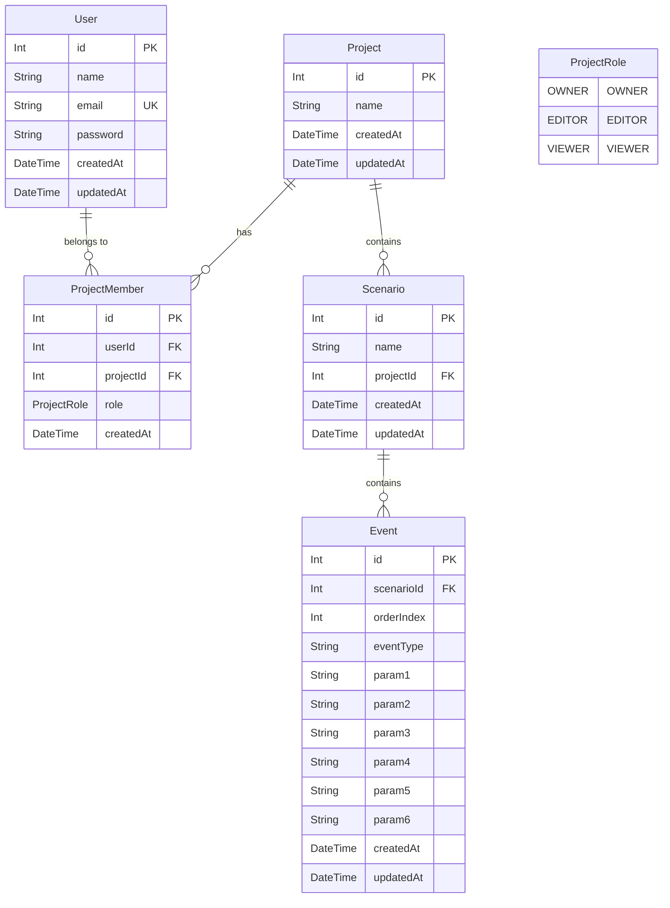

# システム仕様書 (System Specification)

本ドキュメントは、`novel-dashboard` プロジェクトのコードベースおよびDBスキーマの分析結果に基づき作成された仕様書です。
コードから読み取れる**「事実 (Implementation Facts)」**と、設計意図や今後の展望に関する**「推測 (Inferences / Estimations)」**を明確に区別して記載しています。

---

## 1. システム概要・技術スタック

### 【事実】技術スタック
* **Frontend**: Next.js (App Router), React, TanStack Query (`@tanstack/react-query`), Tailwind CSS
* **Backend**: NestJS, TypeScript, Passport.js (`passport-jwt`), bcrypt
* **ORM / Database**: Prisma ORM, PostgreSQL

---

## 2. データモデル仕様 (Prisma Schema)

### 【事実】データモデル構造

### 【事実】エンティティ定義と制約
1. **User**
   * メールアドレス (`email`) に UNIQUE 制約あり。
   * `password` は bcrypt でハッシュ化された文字列を保持。
2. **Project**
   * 作品データのトップレベルエンティティ。
3. **ProjectMember**
   * `User` と `Project` の中間テーブル。
   * 複合ユニーク制約 `@@unique([userId, projectId])` を設定。
   * ロール列挙型 `ProjectRole`: `OWNER`, `EDITOR`, `VIEWER`。
4. **Scenario**
   * `Project` に属するシナリオ単位。`projectId` を外部キーとして参照。
5. **Event**
   * `Scenario` に属する個別演出・テキストイベント。
   * `orderIndex`: シナリオ内での並び順を示す整数（デフォルト値 0）。
   * 複合ユニーク制約 `@@unique([scenarioId, orderIndex])`: 同一シナリオ内で同じ `orderIndex` を重複保持不可。
   * 汎用パラメータフィールド: `param1` 〜 `param6` (すべて Nullable)。

---

## 3. バックエンド アーキテクチャ & API仕様

### 【事実】NestJS モジュール構成
* **`AppModule`**: ルートモジュール。`ConfigModule.forRoot({ isGlobal: true })` や各サブモジュールをインポート。
* **`PrismaModule`**: グローバルモジュール。`PrismaService` を提供。
* **`UserModule`**: ユーザー登録・検索機能を提供。
* **`AuthModule`**: パスワード検証および JWT トークン発行機能を提供 (`PassportModule`, `JwtModule`, `JwtStrategy`)。
* **`ProjectModule`**: プロジェクト一覧取得・作成・詳細取得機能を提供。
* **`ScenarioModule`**: シナリオ一覧取得・作成機能を提供。
* **`EventModule`**: イベント一覧取得・作成・並べ替え機能を提供。

### 【事実】API エンドポイント一覧

| 機能 | HTTPメソッド | エンドポイント | Auth Guard | パラメータ / リクエストBody | レスポンス |
|---|---|---|---|---|---|
| **ユーザー登録** | `POST` | `/users` | なし | `{ name, email, password }` | `User` (パスワード含む) |
| **ログイン** | `POST` | `/auth/login` | なし | `{ email, password }` | `{ access_token }` |
| **デバッグ** | `GET` | `/auth` | なし | なし | なし (`console.log(req.user)`) |
| **プロジェクト一覧** | `GET` | `/projects` | JwtAuthGuard | Header: `Bearer <token>` | 参加中の `Project[]` |
| **プロジェクト作成** | `POST` | `/projects` | JwtAuthGuard | `{ name }` | 作成された `Project` |
| **プロジェクト取得** | `GET` | `/projects/:id` | なし | Path: `id` (number) | `Project` |
| **シナリオ一覧** | `GET` | `/projects/:projectId/scenarios` | なし | Path: `projectId` (number) | `Scenario[]` (`id` 昇順) |
| **シナリオ作成** | `POST` | `/projects/:projectId/scenarios` | なし | Path: `projectId`, Body: `{ name }` | 作成された `Scenario` |
| **イベント一覧** | `GET` | `/scenarios/:scenarioId/events` | なし | Path: `scenarioId` (number) | `Event[]` (`orderIndex` 昇順) |
| **イベント作成** | `POST` | `/scenarios/:scenarioId/events` | なし | Path: `scenarioId`, Body: `{ eventType, param1~6 }` | 作成された `Event` |
| **イベント並べ替え** | `PATCH` | `/scenarios/:scenarioId/events/order` | なし | Path: `scenarioId`, Body: `{ eventIds: number[] }` | `{ message: "Reordered successfully" }` |

---

## 4. 主要ロジック & 処理フロー仕様

### 【事実】プロジェクト作成とOWNER付与フロー
1. クライアントが `POST /projects` に `{ name }` と JWT を送信。
2. `JwtAuthGuard` により JWT が検証され、`req.user.userId` を取得。
3. `ProjectService.create` 内で Prisma トランザクションを実行:
   - `Project` レコードを作成。
   - `ProjectMember` レコードを作成 (`role: 'OWNER'`, `userId`, `projectId`)。

### 【事実】イベント並べ替え (`orderIndex`) のトランザクション処理
1. クライアントが `PATCH /scenarios/:scenarioId/events/order` に `{ eventIds: number[] }` を送信。
2. 対象シナリオの既存イベント件数および ID の存在チェック。
3. **一時退避ステップ**: `@@unique([scenarioId, orderIndex])` 制約違反を防ぐため、全イベントの `orderIndex` を一括でマイナス値 `-(orderIndex + 1)` に一時変更。
4. **再割り当てステップ**: `eventIds` 配列の要素順（0, 1, 2...）に従い、新しい `orderIndex` を順番に設定。
5. トランザクション完了。

---

## 5. フロントエンド画面仕様

### 【事実】現在の画面・コンポーネント構成
* **ルートページ (`frontend/app/page.tsx`)**:
  * タイトル (`<h1>Novel Dashboard</h1>`)
  * `ProjectForm` コンポーネント
  * `ProjectList` コンポーネント
* **`ProjectForm` (`frontend/components/ProjectForm.tsx`)**:
  * プロジェクト名入力用の `<input>` と「作成」ボタン。
  * `useMutation` (TanStack Query) で `createProject` API を呼び出し、完了後に `"projects"` クエリを invalidate。
* **`ProjectList` (`frontend/components/ProjectList.tsx`)**:
  * `useQuery` で `getProjects` API を呼び出し、プロジェクト名のリストを表示。
* **`lib/api.ts`**:
  * `http://localhost:3000` に対する REST fetch 処理を実装 (`getProjects`, `createProject`)。

---

## 6. 実装状況の整理 (事実 vs 推測)

### 【事実】実装済みの機能
* [x] ユーザー登録・ハッシュ化パスワード保存 (`bcrypt`)
* [x] JWT によるログイン認証機能 (`/auth/login`)
* [x] 認証ガード付きプロジェクト作成 API（自動的に作成者を OWNER 設定）
* [x] 認証ユーザー所属プロジェクトの一覧取得 API
* [x] シナリオの作成・一覧取得 API
* [x] イベントの作成・一覧取得 API
* [x] イベント順序変更 (一括 Reorder) API
* [x] フロントエンド基本骨組み（React Query + Fetch によるプロジェクト一覧表示・作成 UI）

### 【事実】未実装・課題事項
* [ ] **フロントエンドの認証連携**: ログイン / 新規登録画面の不在、および fetch リクエスト時の `Authorization: Bearer <token>` のヘッダー設定処理。
* [ ] **フロントエンドのシナリオ・イベントUI**: シナリオ一覧やイベント編集・並べ替え用の UI コンポーネント。
* [ ] **バックエンドのセキュリティ・認可不足**:
  * `ScenarioController` および `EventController` に `JwtAuthGuard` が付与されていない。
  * `ProjectMember` の Role (`OWNER`, `EDITOR`, `VIEWER`) に基づいたアクセス制限ガードが未適用。
* [ ] **更新・削除 API の不足**: Project, Scenario, Event について、EDIT (Update) や DELETE 用の API が存在しない。
* [ ] **デバッグ用エンドポイント**: `GET /auth` が実装途中（`console.log` のみ）で残存。

---

### 【推測】デザイン意図および今後の拡張可能性

1. **ノベルゲーム / スクリプトエンジンのエディタ**
   * **理由**: `Event` テーブルに `eventType` と `param1`〜`param6` という汎用パラメータ列が用意されているため。
   * **推測される用途**: `eventType="text"` (param1: キャラ名, param2: 本文), `eventType="bg"` (param1: 画像パス), `eventType="sound"` (param1: SE/BGM ID) などの演出コマンドをデータモデル変更なしで定義・管理することを目的としていると推測されます。

2. **タイムライン・順序制御型 UI (DnD エディタ)**
   * **理由**: `PATCH /scenarios/:scenarioId/events/order` による一括 ID 配列指定の順序変更ロジックが安全なトランザクションとして整備されているため。
   * **推測される用途**: ドラッグ＆ドロップ（例: `dnd-kit` や `react-beautiful-dnd`）によって直感的にイベントの前後関係を入れ替えられるタイムライン型編集画面の導入が推測されます。

3. **マルチユーザー・チーム共同編集**
   * **理由**: `ProjectMember` に `OWNER`, `EDITOR`, `VIEWER` のロールが事前に設計されているため。
   * **推測される用途**: プロジェクトごとのメンバー招待機能や、「閲覧専用 (VIEWER)」「編集可能 (EDITOR)」といった細かな権限管理機能の拡張が計画されていると推測されます。
